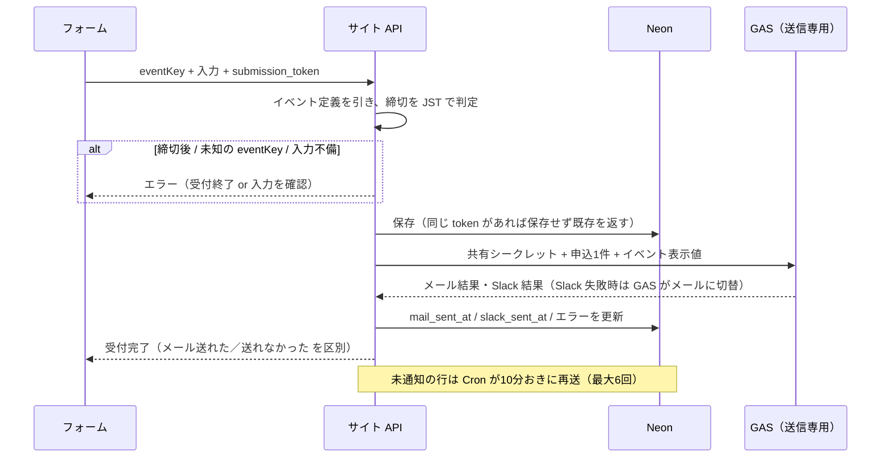
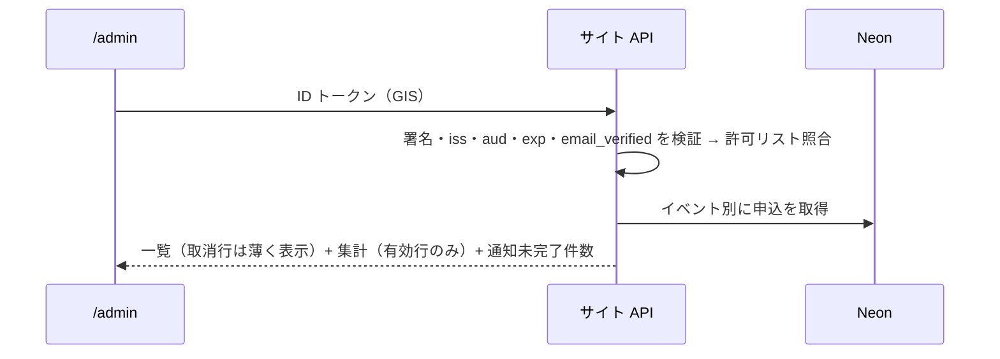
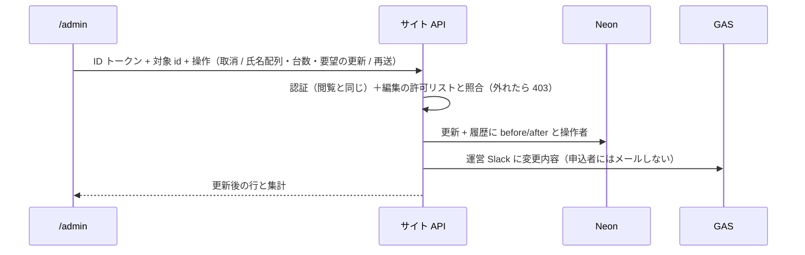
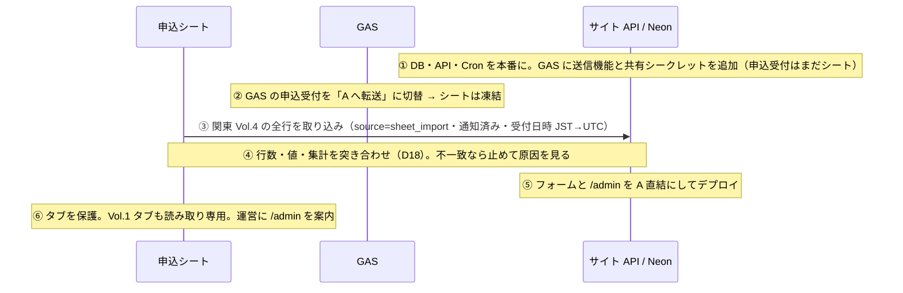

# 申込データの正本をサイト側 DB に移す

状態: 確定
出典: 2026-09-25 清野さんとの壁打ち
更新: 2026-09-26

## 課題

/admin の申込一覧で電話番号の先頭の 0 や + が落ちていた。原因は申込の正本がスプレッドシートで、数字だけの文字列を数値に自動変換していたこと。電話番号自体は 2026-09-25 に応急処置済み（GAS が文字列として書く・既存6件は Slack 通知の原文で修復）。根本原因は「正本が表計算ソフトにある」ことで、清野さんの認識（正本はサイト側 DB）とも食い違っていた。

## 解決した状態

- 申込の正本はサイトと同じ Vercel チームの Neon Postgres。スプシには書かない・読まない
- フォームはサイトの API に送信し、API が DB に保存してから GAS に「メール・Slack の送信だけ」を頼む
- /admin はサイトの API から一覧・集計を読む。清野さんだけが取消と人数・台数の変更をでき、操作は履歴に残る
- 関東 Vol.4 の受付中に、受付を止めず・申込を失わず・二重にせずに切り替わっている
- 関東 Vol.1（旧フォーム・11件）はシートを読み取り専用で残す。DB には入れない

## 主なコンテキスト

**バックエンドが主。** 理由: 変えるのはデータの正本・保存と通知の経路・移行で、画面の見た目は変えない。/admin の取消・変更ボタンは、この正本を操作するための従として扱う。

| 項目 | 事実 |
|---|---|
| サイト | Vercel（Pro）で静的 HTML 配信のみ。サーバー処理・DB なし。main マージで本番デプロイ |
| 申込フロー | フォーム → GAS Web アプリ（匿名で呼べる・清野さんのアカウントで実行）→ シート追記 → 自動返信メール → 運営 Slack（失敗時はメール） |
| /admin | GIS の ID トークンを GAS が tokeninfo で検証（iss / aud / exp / email_verified）→ 許可リスト5名と照合 → シートを読む。閲覧者は清野さん・社内1名・運営（社外3名） |
| 締切・定員 | 締切はフロントの `EVENTS` が判定（deadline の 23:59 JST）。**サーバーでは判定していない**。定員20名は表示のみ・自動締切しない（既存方針） |
| 受付状況 | 関東 Vol.4 締切 2026-09-30。9/25 時点 8社14名。関西 Vol.2 はテスト申込1件のみ |
| 応急処置後のシート | 電話番号は `'` 付きの文字列。受付日時は JST の文字列 |

## 設計の意図

守るもの: **DB に保存できた時点で申込は成立**（通知はあとから何度でも送り直せる）。**個人情報を返す API は必ず ID トークン検証を通す**（aud 検証を外さない）。

| # | 決めたこと | 意図 | 選ばなかった案 |
|---|---|---|---|
| D1 | 正本は Vercel Marketplace の Neon Postgres。スプシは書きも読みもしない（清野さんの判断） | 型を持つ DB なら電話番号の崩れが構造的に起きない。サイトと同じチームに置いて権限を1か所にする | → Google Sheets を型付きで使い続ける: 手入力・自動変換の事故が残る |
| D2 | 申込1件＝1行。参加者氏名は配列で持ち、先頭を代表者にする。**人数は別に持たず配列の長さ** | 人数と氏名の数が食い違う状態を作れなくする。氏名は一覧・メールで並べて見るだけで個別に検索しない | → 参加者を別表にする: 結合が要るだけで得るものがない |
| D3 | 電話番号・役職など文字列は入力原文のまま。日時は UTC で保存し、表示・メール・Slack で JST に直す | 正本は加工しない。UTC は Vercel と Neon の既定で、JST 表示は1か所で変換できる | → JST の文字列で保存: 並べ替え・比較のたびに解釈が要る |
| D4 | イベント定義（名前・日程・会場・内容・締切・定員）は**リポジトリの1か所**に置き、フォーム・LP・/admin・API が同じ定義を読む。**フォームは eventKey だけ送る**。API が締切（23:59:59 JST）をサーバーでも判定する。申込行にはイベント名を時点値として持つ | クライアントが送った本文をそのまま清野さんのアカウントからメールにしない（今の GAS は送られた会場・内容をそのままメールにしており、誰でも任意の宛先・文面で送らせられる）。古いタブから締切後に送っても止まる。イベントの追加は LP 作成と同じくコードの変更なので、定義もコードと一緒に置く | → DB に events 表: フロントの定義と正本が2つになる。→ フォームが送るイベント情報を信じる: API が任意文面のメール中継になる |
| D5 | 取消は削除ではなく **状態（有効／取消）**。取消日時・操作者を持つ。取消行は一覧に薄く残し、集計（社数・人数・残り枠・台数）から外す | 申込者との連絡の証跡。誤取消の追跡。復元 UI は付けない（必要なら再申込） | → 物理削除: 「取り消したはず」の照会に答えられない |
| D6 | 取消・変更・再送・移行は **履歴表**に「誰が・いつ・何を（変更前後）」を残す | 5名が操作でき、申込者と食い違ったときに確かめる先が要る | → 更新日時と最終操作者だけ: 2回目以降の変更が消える |
| D7 | 申込は DB 保存 → GAS 送信の順。**保存できた時点で申込者に「受け付けました」**。行に通知状態（メール送信日時・Slack 送信日時・失敗内容・試行回数）を持つ | 通知が失敗しても申込が消えない。再送できる | → メールまで成功してから保存: メール失敗で申込が消える |
| D8 | 通知の失敗は **10分おきの Cron が未通知の行を再試行**（最大6回）。加えて /admin に「通知未完了 n件」と行ごとの再送ボタン | 1日数件でも申込者への確認メール漏れは信用に関わる。GAS 停止中にも自動で追いつく。6回超えは /admin で人が拾う | → /admin の再送ボタンだけ: Slack が飛ばないと誰も /admin を見ない |
| D9 | 二重送信は **フォームが送信ごとに作る申込トークン（UUID）** を DB で一意にして防ぐ。同じトークンの再送は保存せず同じ結果を返す。同じイベント・同じメールの2件目は保存し、Slack 通知に「同メールで申込あり」と注記して運営が判断 | 連打・通信リトライは同じトークンで来る。同メール2件目は正当な場合（別グループ）があり、取消機能で消せる | → メール＋イベントで一意: 正当な2件目を弾く |
| D10 | サイト→GAS・GAS→サイトの呼び出しは **共有シークレット**（Vercel 環境変数と GAS スクリプトプロパティに同じ値）を本文に入れ、一致しないものを GAS は拒否。GAS はデータを持たず、送信の入力は API が組み立てた申込1件 | GAS は匿名で呼べるため、シークレット無しの送信要求を通すと清野さんのアカウントの踏み台になる。宛先は申込行のメールに固定され、任意宛先には送れない | → GAS の公開範囲を狭める: Vercel からの呼び出しは Google アカウントを持てない |
| D11 | 旧経路は **GAS の申込受付を「サイト API への転送」に置き換えて閉じる**。古いタブ・キャッシュされた旧 HTML からの送信は GAS が API に転送し、DB に入る（送信元＝転送と記録）。転送は関西 Vol.2 締切まで残す。**GAS の一覧 API（旧 /admin が呼ぶ）は「移転しました。再読み込みしてください」を返し、シートを読まない** | 捨てずに拾える。GAS はシートに書かず、DB は1つのまま。旧 /admin を開いたままの人に止まったシートの古い一覧を見せない | → GAS が当面シートにも書く: 突き合わせが続き正本が2つになる |
| D12 | /admin の認証はサイトの API で行う。GIS の ID トークンを Google の公開鍵（または tokeninfo）で検証し iss / aud / exp / email_verified を見る。**aud は今の OAuth クライアント ID**。許可リストは Vercel の環境変数（メールをカンマ区切り） | 今と同じ検証項目・同じクライアント ID なので OAuth 同意画面（Testing・Test users）は触らない。許可リストは GAS のプロパティと同じ運用を Vercel に移すだけ | → 許可リストを DB 表に: 5名で変更が稀、管理 UI が要る |
| D13 | 取消・変更は**清野さんだけ**ができる（清野さんの判断）。閲覧の許可リスト（5名）とは別に**編集の許可リスト**（清野さん1名）を持ち、API が操作ごとに照合する。ほかの4名の画面には取消・変更のボタンを出さない。変更できるのは参加者氏名（＝人数）・台数・ご要望のみ。会社名・代表者・メール・電話は変えない（変えるなら取消＋再申込） | 個人情報を書き換えられる人を1人に絞り、運営からの取消・変更の連絡は清野さんが受けて反映する。ボタンを隠すだけでなく API で拒否するので、画面を改変しても操作できない。連絡先を書き換えると自動返信の宛先と履歴がずれる | → 閲覧できる5名全員: 社外の運営が申込者の情報を書き換えられる |
| D14 | 変更・取消の通知は **運営 Slack にだけ**送る（申込者へのメールは送らない・清野さんの判断） | 申込者と話した結果を反映する操作なので、申込者に改めてメールする必要がない。運営は Slack で変更を知る | → 申込者にも変更確認メール: 文面と差出人の設計が増え、切替が遅れる |
| D15 | Slack 通知の「申し込み一覧を開く」は /admin へのリンクにする | シートは正本でなくなる | — |
| D16 | 関東 Vol.4 の既存申込はシートから DB に取り込み、受付日時は JST 文字列を UTC に直して保つ。**取り込んだ行は通知済みとして入れる**。関西 Vol.2 のテスト申込1件は DB に入れない（シートに残す） | 再送 Cron が既存申込者にメールを送り直す事故を防ぐ。テストは集計を汚す | → テストも取り込んで取消状態にする: 実申込0件のイベントに取消1件が残るだけ |
| D17 | 切替順序: ①DB・API・GAS 送信機能を用意 → ②GAS の申込受付を転送に切替（この瞬間からシートに新規行が増えない）→ ③シートを DB に取り込み → ④突き合わせ → ⑤フォームと /admin を API 直結に → ⑥シートのタブを保護（読み取り専用）。実施は実装と検証が済みしだい、清野さんの合図で（関東 Vol.4 締切 9/30 より前・申込の少ない夜間） | ②でシートが凍結されるので、取り込みと新着の競合窓が無い。1日4社来る日でも失わない | → 先に取り込んで後で GAS を切替: 取り込み〜切替の間の新着を手で突き合わせる |
| D18 | 完了判定: シートの関東 Vol.4 データ行数 ＝ DB の「移行」行数、かつ全行で会社名・メール・電話番号（原文）・人数・台数・受付日時（JST 表示）が一致、かつ /admin の集計がシート由来の数と一致。1件でも違えば ⑤に進まない | 数だけでなく値の一致で電話番号の崩れが再発していないことを確かめる | — |
| D19 | **プレビューのデプロイは本番の DB と GAS に触れない。** DB 接続・共有シークレット・許可リストは本番環境だけに置き、プレビューは Neon のプレビュー用ブランチ（本番データを含まない）を使い、通知は送らない | PR のたびにプレビューが作られる。本番 DB への書き込みや、実在の申込者・運営チャンネルへの送信を起こさない | → プレビューも本番と同じ設定: テスト申込が本番の一覧と Slack に出る |
| D20 | 申込データは**削除しない**（保存期間を設けない・清野さんの判断）。取消した申込も状態として残す | 参加履歴を次回の案内や顧客対応に使い続ける。消さない前提なので、Neon を直接見られる人を清野さんに限り、運営は /admin 経由だけにする | → イベント終了後6か月で削除: 参加履歴を使えなくなる |

## アウトプット

### ① データ定義

**イベント定義（リポジトリの1か所・正本。DB には持たない・D4）**

| 項目 | 型 | 備考 |
|---|---|---|
| key | 文字列 | `kanto-vol4` など。フォームが送る値。申込行の event_key |
| name / date_text / place / detail | 文字列 | 画面・メール・Slack に載せる表示値 |
| deadline | 日付（JST） | この日の 23:59:59 JST 以降は API が受け付けない |
| capacity | 整数・任意 | 表示と残り枠計算のみ。締切に使わない |

**applications（申込・正本）**

| 列 | 型 | 備考 |
|---|---|---|
| id | UUID・主キー | サーバーが採番 |
| submission_token | UUID・一意 | フォームが送信ごとに生成（D9） |
| event_key | 文字列 | イベント定義の key |
| event_name | 文字列 | 申込時点のイベント名（時点値） |
| company / representative_name / role / email | 文字列 | 入力原文 |
| tel | **文字列** | 入力原文。数値にしない |
| attendees | 文字列の配列 | 先頭＝代表者。人数＝配列の長さ（D2） |
| car_count | 整数（0〜5） | |
| message | 文字列・任意 | |
| status | `active` / `cancelled` | D5 |
| received_at | UTC 日時 | 表示は JST |
| cancelled_at / cancelled_by | UTC 日時 / メール・任意 | |
| source | `site` / `gas_forward` / `sheet_import` | 経路の記録（D11・D16） |
| mail_sent_at / slack_sent_at | UTC 日時・任意 | 未設定＝未通知 |
| notify_attempts / notify_last_error | 整数 / 文字列 | Cron の再試行判断（D8） |
| updated_at | UTC 日時 | |

**application_changes（履歴）**

| 列 | 型 | 備考 |
|---|---|---|
| id / application_id | UUID | |
| changed_at / changed_by | UTC 日時 / メール | 操作者。Cron・移行は固定の名前 |
| action | `cancel` / `update` / `notify` / `import` | |
| before / after | JSON | 変更した項目だけ |

**設定値の置き場**（値は書かない）

| 値 | 置き場 |
|---|---|
| DB 接続情報 | Vercel（Neon 連携が自動で入れる） |
| サイト↔GAS 共有シークレット | Vercel 環境変数 と GAS スクリプトプロパティ |
| /admin 閲覧の許可リスト・OAuth クライアント ID | Vercel 環境変数（今の GAS プロパティから移す） |
| /admin 編集の許可リスト（D13） | Vercel 環境変数 |
| Slack Bot トークン・通知チャンネル | GAS スクリプトプロパティ（今のまま） |

### ② 処理の流れ

**申込**

古いタブ・旧 HTML からの送信は GAS に届くが、GAS はシートに書かず「共有シークレットを付けて A に転送」し、同じ応答を返す（D11）。

**管理画面の閲覧**

**取消・変更**

**移行（D17）**

## ユースケース

| # | 場面 | 入力・条件 | 期待する結果 |
|---|---|---|---|
| U1 | 通常の申込 | 必須項目あり・人数3・台数1・締切前 | DB に1行（source=site）、メール・Slack 送信、行に送信日時。画面「受付確認のメールをお送りしました」 |
| U2 | 電話番号の保持 | `090…`、`+81…`、ハイフンあり | /admin・メール・Slack に入力原文のまま出る |
| U3 | ボタン連打・リトライ | 同じ token で2回届く | DB は1行。2回目も受付完了を返す。メールは1通 |
| U4 | 同じメールで2件目 | 別トークン・同イベント | 2行とも保存。Slack に「同メールで申込あり」注記 |
| U5 | 締切後の送信 | 締切日の 23:59:59 JST 以降、古いタブから | API が拒否。「申込受付は終了しました」。DB に入らない |
| U6 | 締切直前 | 締切日 23:59 JST に送信 | 受け付ける |
| U7 | 未知の eventKey・人数と氏名数の不一致・メール形式不正 | | 拒否。DB に入らない |
| U8 | GAS が応答しない | DB 保存は成功 | 画面「受け付けました。確認メールは追ってお送りします」。Cron が再送し、成功したら送信日時が入る。/admin に未完了件数 |
| U9 | Slack だけ失敗 | メール成功 | GAS が運営宛メールに切替。slack_sent_at は入り、行の失敗内容は空 |
| U10 | 再試行が6回超過 | GAS が長時間停止 | Cron は止め、/admin の未完了バッジに残る。再送ボタンで手動再送できる |
| U11 | DB 保存が失敗 | Neon 障害 | メール・Slack は送らない。画面は既存の「送信に失敗しました。直接メールで連絡を」 |
| U12 | 旧 HTML からの送信 | GAS 直送 | GAS が API に転送、DB に source=gas_forward で1行。シートには書かない。応答は今と同じ |
| U13 | シークレット無しで GAS の送信機能を叩く | 外部からの POST | 拒否。メールは出ない |
| U14 | /admin 閲覧 | 許可リストのアカウント | 一覧と集計。取消行は薄く表示され集計外 |
| U15 | /admin 不正トークン | 別サイト向け aud・期限切れ・未検証メール・許可外 | 403。データを返さない。既存の再ログイン導線 |
| U16 | 取消 | 清野さんが有効行を取消 | status=cancelled、取消日時・操作者、履歴1件、Slack 通知。残り枠が増える |
| U17 | 人数変更 | 清野さんが同行者を1名追加 | attendees が4要素、人数表示4、履歴に before/after、Slack 通知 |
| U18 | 取消行の変更 | | 拒否（取消後は編集しない） |
| U18b | 清野さん以外の取消・変更 | 閲覧の許可リストにだけいる運営が /admin を開く／API を直接叩く | 画面に取消・変更ボタンが出ない。API は 403 で拒否し、DB も履歴も変わらない |
| U19 | 連絡先の変更 | メール・電話を変えたい | UI にない（取消＋再申込で対応・D13） |
| U20 | 移行の一致 | 切替時点のシートの関東 Vol.4 全行 | DB の移行行が同数、値一致、集計がシート由来の社数・人数と一致。既存申込者にメールが飛ばない |
| U21 | 移行中の新着 | ②〜③の間の申込 | GAS 転送で DB に入る。シートに増えない。received_at が移行行より後 |
| U22 | 関西 Vol.2 | テスト1件 | DB に無い。/admin の関西は0件 |
| U23 | 既存機能との矛盾: 定員到達 | 有効人数が20を超える申込 | 受け付ける（表示のみ・既存方針）。/admin の残り枠がマイナス表示 |
| U24 | 既存機能との矛盾: 「その他」タブ | 未登録キー | 旧は「その他」に記録、新は拒否（U7）。フロントは登録キーしか送らないので実害なし |
| U25 | 旧 /admin を開いたまま | 切替前に開いたタブで再読込ボタン | GAS が「移転しました。再読み込みしてください」を返す。シートの古い一覧は出ない |
| U26 | プレビューのデプロイで申込 | PR のプレビュー URL から送信 | プレビュー用 DB に入る。本番の一覧・運営 Slack・申込者メールに何も出ない |

## 未確定事項

| 項目 | 誰に聞くか | 期限 | 回答 |
|---|---|---|---|
| 取消・変更を許可リスト5名全員に開放するか（D13） | 清野さん | 9/26 | 清野さんだけ（9/26 回答） |
| 変更・取消時に申込者へメールを送るか（D14） | 清野さん | 9/26 | 送らない。運営 Slack のみ（9/26 回答） |
| 個人情報の保存期間（D20） | 清野さん | 9/26 | 削除しない（9/26 回答） |
| シートの関東 Vol.4 タブを消すか（推奨: 切替後1週間問題がなければ削除し、正本以外の写しを残さない。Vol.1 は読み取り専用で残す） | 清野さん | 10/5 | |
| Neon のバックアップ（推奨: 復元できる期間をプラン仕様で確認し、足りなければ週1で書き出し。消さない前提なので復元手段は必須） | 実装の清野 | 実装時 | |
| 切替後の本番確認のテスト申込（推奨: 清野さんが1件申し込み→取消で U1・U16 を確認。運営 Slack に出るので事前にチャンネルで一言断る） | 清野さん | 切替当日 | |
| API の連打対策（推奨: Vercel Firewall のレート制限を申込 API に設定。同一 IP 1分10回） | 実装の清野 | 実装時 | |

## 差し戻し

実装側（2026-09-30）から。実装では設計どおりにし、次は設計の判断待ち。

| # | 論点 | 実装での扱い | 設計に聞きたいこと |
|---|---|---|---|
| R1 | 取消済みの行に通知が残っているとき（GAS 停止中に申込→取消） | Cron・再送とも有効行だけを対象にし、取消行には送らない | この解釈でよいか。「取消したが受付メールは送りたい」場面があれば再送の条件を変える |
| R2 | 台数の上限 | データ定義「整数（0〜5）」を API・DB の CHECK で守る（旧 GAS は ≧0 のみ） | 6台以上の申込を将来受けるならフォームと一緒に定義を変える |
| R3 | GAS の転送先が未設定のとき（旧 HTML の申込） | ok=false を返し、シートにも書かない | 設計は「シートに書かない」が正。切替手順4（GAS プロパティ設定）を手順6（GAS デプロイ）より必ず先にする運用で足りるか |
| R4 | 未確定事項「Neon のバックアップ」「Vercel Firewall のレート制限」 | コードでは扱わず未実施 | プラン仕様の確認とダッシュボード設定が要る。切替当日でなくてよいか |
| R5 | README の申込フロー説明 | 触っていない（設計にない） | 切替後に README を DB 前提に書き換える作業を別に立てるか |

設計側の回答（2026-09-30 レビュー）: R1〜R3 は実装の扱いで確定（R3 は切替手順で GAS プロパティを GAS デプロイより先に設定する）。R4 は切替時に実施（Neon の復元期間の確認・申込 API のレート制限）。R5 は切替後に README を DB 前提に直す別作業にする。いずれも差し戻しではない。
