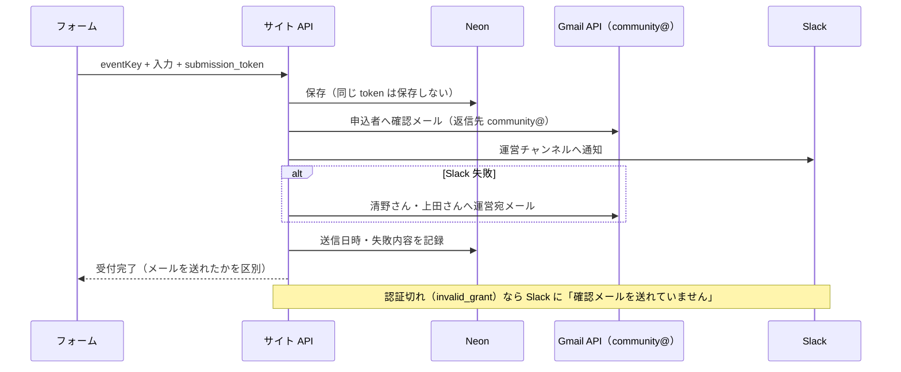

# 申込の GAS とスプレッドシートを廃止する

状態: 設計中
出典: 清野さん 2026-10-05「そもそもスプレッドシートはやめたい　ポータルサイト側のDBに統一が理想」「GASもやめたい」
前提の設計: `docs/designs/2026-09-25-applications-db/design.md`（以下「旧設計」。DB・API・/admin・Cron はそのまま使う）
更新: 2026-10-05

## 課題

旧設計は正本を DB に移したが、メールと Slack の送信のために GAS を残していた。GAS が残ると、設定（スクリプトプロパティ・デプロイ・実行アカウント）がサイトの外にあり、清野さん個人のアカウントで送信し続け、サイトと GAS の間に共有シークレットと転送の経路が要る。申込の仕組みを見る場所が2つに分かれたままになる。

## 解決した状態

- 申込の受付・保存・通知・閲覧・取消・変更が、ポータル（Vercel＋Neon）だけで完結する。GAS のデプロイはアーカイブ、スプレッドシートは保護した控えになり、どちらも使わない
- 確認メールは community@recore-corp.jp から届き、申込者の返信は清野さん・上田さんに届く

## 主なコンテキスト

バックエンド。理由：画面（フォーム・/admin）は旧設計の PR #9 のまま変わらず、変わるのは通知の送り方と設定の置き場だけ。

## 設計の意図

守るもの：**申込者に確認メールが確実に届き、運営が申込を取りこぼさないこと**を、GAS 抜きで今と同じ水準に保つ。

| # | 決めたこと | 意図 | 選ばなかった案 |
|---|---|---|---|
| D1 | GAS を廃止し、申込者メール・運営 Slack・運営宛のフォールバックメールをサイトの API から直接送る（清野さんの判断） | 設定と処理を Vercel の1か所に集める。GAS を踏み台にさせないための共有シークレット（旧 D10）が要らなくなる | → GAS を送信専用で残す（旧設計）：設定がサイトの外に残り、見る場所が2つ |
| D2 | 送信元は新設の Workspace ユーザー **community@recore-corp.jp**（表示名「RECOREコミュニティ事務局」）。Gmail API で送る（清野さんの判断） | 個人アカウントに依存しない。Google から送るので到達率は今と同じで、recore-corp.jp の DNS を変えずに済む | → seino 名義のまま Gmail API：個人依存が残る／→ Resend 等：DNS 変更とドメイン管理者の作業が要る |
| D3 | 認証は community@ が一度だけ許可した OAuth のリフレッシュトークン（スコープは **gmail.send だけ**）を Vercel 本番の環境変数に置く。OAuth クライアントは同意画面が「内部」のもの | 権限を「送信」だけに絞る。内部アプリならトークンが7日で失効しない | → サービスアカウント＋ドメイン全体の委任：組織全体に効く権限を管理者に付けてもらう必要があり、依頼が重い |
| D4 | 確認メールの返信先は community@。community@ に届いたメールは清野さん・上田さんに自動転送（清野さんの判断）。**運営宛のフォールバックメールは community@ を経由せず、清野さん・上田さんに直接送る** | 運営を足すときは転送先を増やすだけで済む。自分宛に送ったメールは転送されないことがあるため、運営宛は直接にする | → 返信先を清野さん個人：運営が増えたときに届かない |
| D5 | Slack は今の Bot トークンとチャンネル（recoreコミュニティ運営・`C08PTUBAWGZ`）をそのまま使い、トークンを Vercel 本番に移す。Slack が失敗したら運営宛メール（D4）に切り替える。文面はメール・Slack とも今の GAS と同じ | 運営から見た通知は何も変わらない | — |
| D6 | 送るタイミング・失敗の扱いは旧設計 D7・D8 のまま（保存→送信→応答。未送信は Cron が10分おきに最大6回再送、/admin に未通知件数と再送ボタン）。加えて、**メールの認証が切れた（invalid_grant）ときは Slack に「確認メールを送れていません」と出す** | トークン失効は全件に効くので、Cron が黙って失敗を重ねる前に運営が気づける | → Cron と /admin だけ：誰も /admin を開かなければ気づかない |
| D7 | 旧 GAS は切替と同時にデプロイをアーカイブする。プロジェクトは消さない（清野さんの判断）。古いタブからの送信は既存の「送信に失敗しました…直接ご連絡ください」になる。旧 D11（転送）は廃止 | 受付中は関西 Vol.2 だけで実申込0件。転送を残すと GAS の設定と監視が残る | → 関西の締切（11/20）まで転送で残す：GAS をやめるのが1か月半遅れる |
| D8 | スプレッドシートは取り込み・突き合わせ（旧 D18）のあと全タブを保護する。関東 Vol.1（11行・終了済み）は切替後に別 PR で DB に取り込み、そのあとシートは参照もしない | 切替を先に終わらせ、過去分は落ち着いて入れる | → Vol.1 も同時に入れる：切替が遅れる |
| D9 | プレビューのデプロイはメールも Slack も送らない（通知の設定を本番だけに置く。旧 D19 と同じ） | プレビューのテスト申込が実在の申込者・運営チャンネルに届かない | — |
| D10 | 切替順序（旧 D17 を置き換え）は下の「切替の流れ」のとおり。GAS とサイトの設定値（ADMIN_EMAILS・SLACK_BOT_TOKEN）はアーカイブ前に GAS のスクリプトプロパティから Vercel に移す。旧設計のために入れた `GAS_URL`・`GAS_SHARED_SECRET` は消す | 切替のあいだも申込口が必ずどこか1つ開いていて、取りこぼしを最後の再確認で拾える | — |

## アウトプット

### 設定（Vercel 本番の環境変数だけに置く）

| 持つもの | 値 | 誰がいつ入れるか |
|---|---|---|
| 送信元 | community@recore-corp.jp・表示名「RECOREコミュニティ事務局」 | Claude・切替前 |
| Gmail の OAuth クライアント ID・シークレット・リフレッシュトークン | community@ が gmail.send を許可して得た値（D3） | 清野さんが community@ でログインして許可 → Claude が登録 |
| 返信先 | community@recore-corp.jp | Claude |
| 運営宛（フォールバック） | seino@recore-corp.jp, ueda@recore-corp.jp | Claude |
| Slack の Bot トークン・チャンネル | GAS の SLACK_BOT_TOKEN・`C08PTUBAWGZ` | Claude（GAS 画面から移す） |
| /admin の閲覧許可 | GAS の ADMIN_EMAILS と同じ | Claude（GAS 画面から移す） |
| 消すもの | `GAS_URL`・`GAS_SHARED_SECRET` | Claude |

DB（applications・application_changes）は変えない。`mail_sent_at`・`slack_sent_at`・`notify_attempts`・`notify_last_error` の意味も旧設計のまま。

### 申込の流れ

### 切替の流れ

| 順 | 作業 | 申込口 |
|---|---|---|
| ① | community@ を作成（伊藤さん）→ 清野さん・上田さんへの転送を設定 → gmail.send を許可 | GAS @13 → シート |
| ② | 本番の環境変数を入れる（上の表） | 同上 |
| ③ | PR #8 をマージ（API が出る。画面はまだ GAS） | 同上 |
| ④ | シートの関東 Vol.4 を取り込み → 突き合わせ（旧 D18） | 同上 |
| ⑤ | PR #9 をマージ → 直後に GAS のデプロイをアーカイブ | **サイト API → DB** |
| ⑥ | シートの行数を再確認（関東 16・関西 1 から増えていれば取り込む）→ 本番でテスト申込→取消 → シートを保護 | 同上 |

## ユースケース

| # | 場面 | 入力・条件 | 期待する結果 |
|---|---|---|---|
| U1 | 通常の申込 | 関西 Vol.2 に1件 | 申込者に community@ から確認メール（表示名・返信先 community@・文面は今と同じ）。運営 Slack に1件。DB に送信日時2つ |
| U2 | 申込者が返信 | 確認メールに返信 | 清野さん・上田さんに届く |
| U3 | Slack だけ失敗 | Bot トークンが無効 | 清野さん・上田さんに運営宛メール。`slack_sent_at` が入り、失敗内容が残る |
| U4 | Gmail が一時的に失敗 | Gmail API が 500・タイムアウト | 申込は保存。画面は「受付確認のメールは追ってお送りします」。Cron の再送で届き、二重に送らない |
| U5 | メールの認証切れ | リフレッシュトークンが失効 | 申込は保存。Slack に「確認メールを送れていません」。トークンを入れ直すと Cron・/admin の再送で届く |
| U6 | 取消・変更 | /admin で清野さんが操作 | 運営 Slack にだけ通知（旧 D14）。Slack 失敗時は運営宛メール |
| U7 | 古いタブから申込 | 切替前に開いた関西フォームから送信 | 「送信に失敗しました…直接ご連絡ください」。DB にもシートにも入らない |
| U8 | 切替中にシートへ新着 | ③〜⑤の間に GAS 経由の申込 | ⑥の再確認で見つかり、DB に取り込まれる |
| U9 | プレビュー | プレビュー URL で申込 | DB（プレビュー用）に保存のみ。メール・Slack は送らない |
| U10 | 日本語・記号 | 会社名・氏名に全角記号・機種依存文字・絵文字 | 件名・本文・差出人表示名が文字化けしない |
| U11 | 移行の一致 | 関東 Vol.4 の16行 | 旧 D18 の完了判定（16社・32名・7台・全行の値一致） |
| U12 | GAS が残っていない | 切替後 | GAS のデプロイはアーカイブ済み。Vercel に `GAS_URL`・`GAS_SHARED_SECRET` が無い。コードに GAS の呼び出しが無い |

旧設計のユースケースのうち、GAS に関わる U12（旧 HTML の転送）・U13（シークレット無しの GAS 呼び出し）・U25（旧 /admin の移転表示）は廃止。U8・U9・U10・U26 は「GAS」を「Gmail・Slack」に読み替えて引き継ぐ。

## 未確定事項

| 項目 | 誰に聞くか | 期限 | 回答 |
|---|---|---|---|
| community@recore-corp.jp の作成とログイン情報の受け渡し | 伊藤さん（清野さんが Slack で依頼） | 2026-10-09 | |
| OAuth クライアントの同意画面が「内部」か。違えば内部のクライアントを作る（D3） | 清野さんが Google Cloud コンソールで確認（Claude が画面で見る） | ①の前 | |

どちらも切替（①）を止めるが、実装とモックでの検証は止めない。

## 差し戻し
