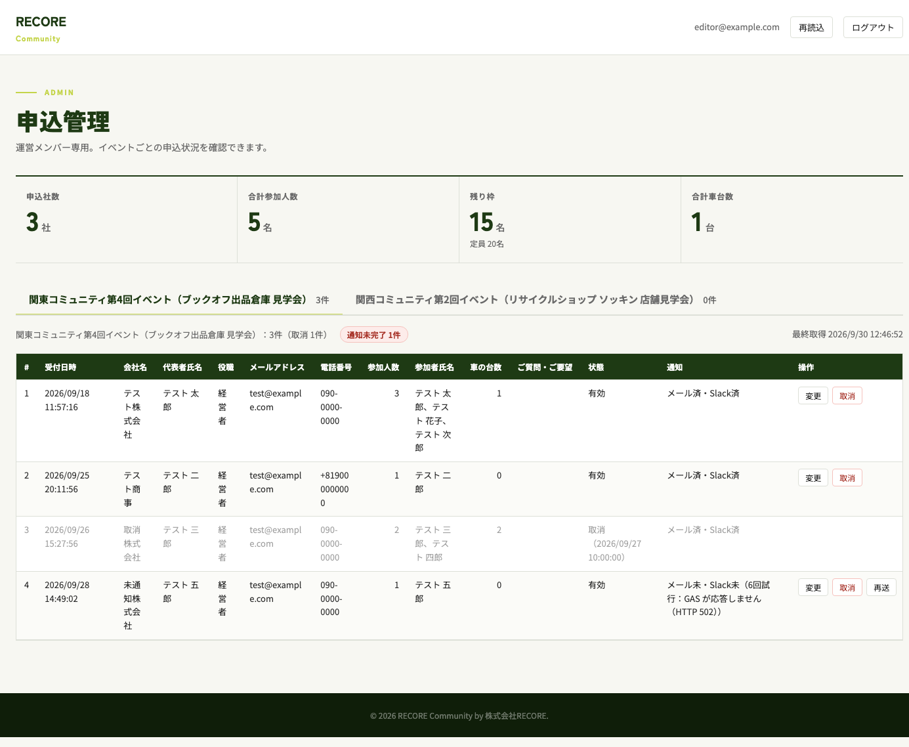
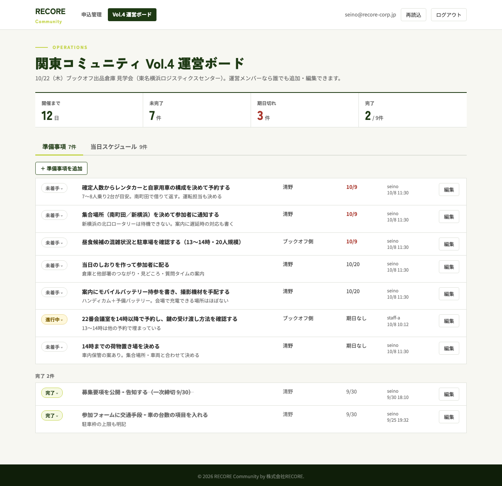
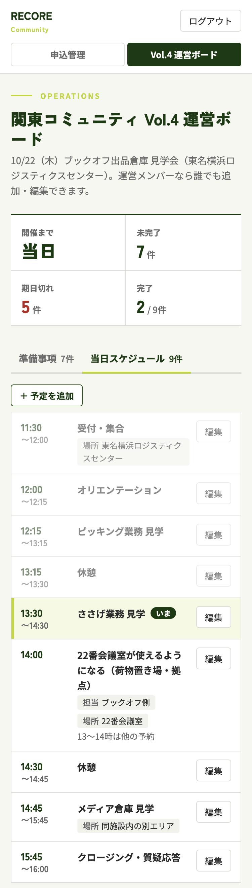
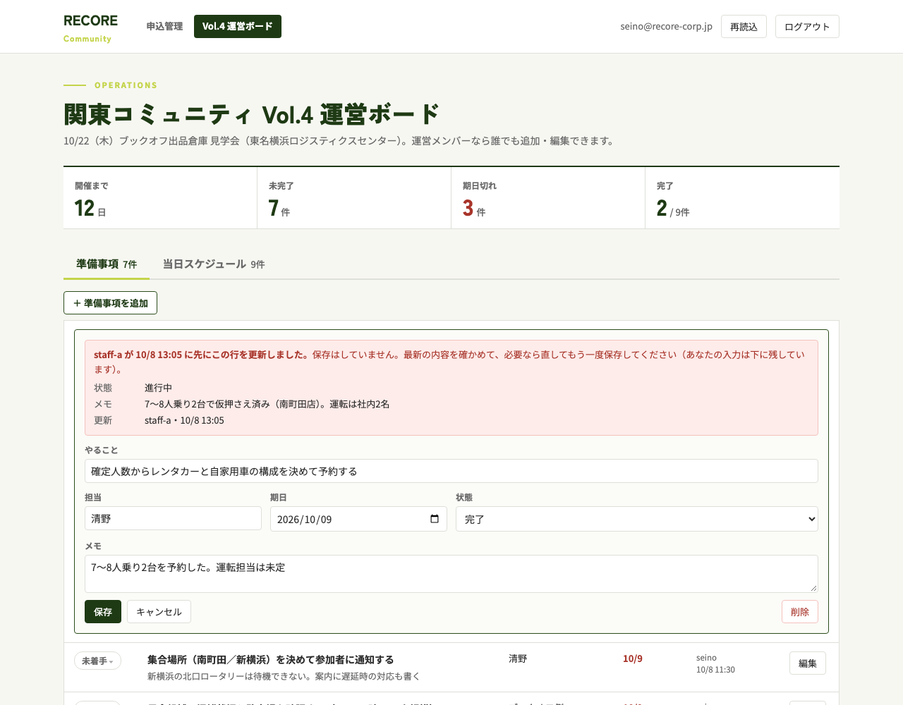
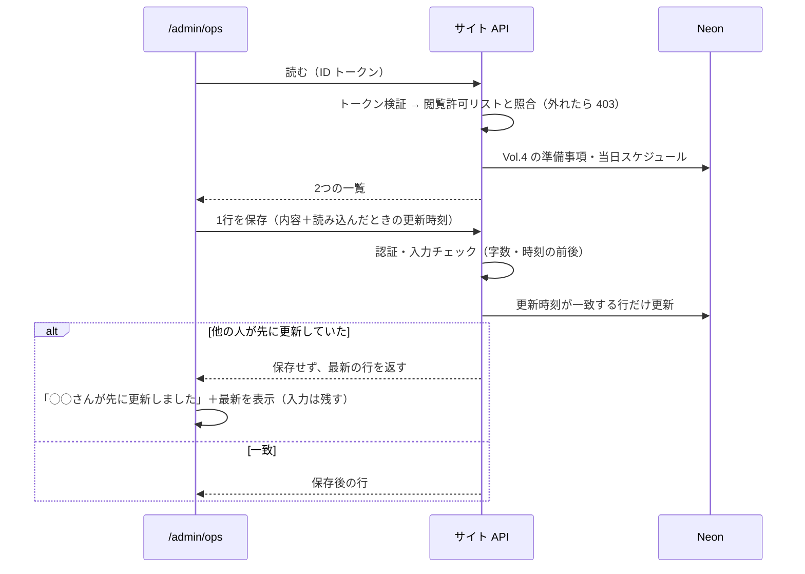

# 関東 Vol.4 の運営ボード（準備事項・当日スケジュール）

状態: 設計中
出典: 清野さん 2026-10-08「運営側のページにイベントまでの準備事項だったり当日のタイムスケジュールなどを管理できる機能が欲しい　フロント画面からの編集もできると理想」「まずは22日のイベントのもので作りたい　テンプレってよりは」／9/10 瀬谷センター下見の議事録（Notion・プロジェクト系議事録DB）
前提の設計: `docs/designs/2026-09-25-applications-db/design.md`（D12 認証・D19 プレビュー）・PR #8
更新: 2026-10-08

## 課題

関東 Vol.4（10/22・ブックオフ瀬谷センター見学）の運営は、社内2名と社外3名（ブックオフ側を含む）の混成。準備のやること（会議室・レンタカー・集合場所・昼食・しおり）は下見の議事録の表にしかなく、誰がどこまで終えたかを運営全員が同じ場所で見られない。当日の段取り（送迎・会議室の開く時刻など）も、参加者向けの LP の時間割以外に置き場がない。

## 解決した状態

- 運営5名が `/admin/ops` を開けば、Vol.4 の準備事項の進み具合と当日のタイムスケジュールが見え、その場で追加・変更・完了にできる
- 当日はスマホで開いて「いま・次に、誰がどこで何をするか」が分かる

## 主なコンテキスト

フロントエンド。理由：価値は運営が画面で見て直せること。API と DB の表は、その画面を成り立たせる最小限の読み書き（従）。

## 設計の意図

守るもの：**運営の誰が直しても、他の人の変更を黙って消さず、全員が同じ最新を見られること。**

| # | 決めたこと | 意図 | 選ばなかった案 |
|---|---|---|---|
| D1 | Vol.4 専用。イベントの切替・タスクの雛形は作らない。データにはイベントの key（`kanto-vol4`）だけ持たせる（清野さんの判断） | 2週間後の本番に間に合う量に絞る。key は申込と同じ持ち方で、次のイベントで表を作り直さずに済む | → 雛形を作ってイベントごとに複製：1回目で何が要るか分かる前に型を決めると外す |
| D2 | `/admin` とは別のページ `/admin/ops`。両ページのヘッダーに「申込管理｜Vol.4 運営ボード」の切替を置く | 当日はスマホで直接開く（Slack にリンクを貼る）。申込一覧は横長の表でスマホに向かず、開くたびに読み込ませない | → /admin の中にタブ：イベントのタブと二重になり、当日も申込の表を読み込む |
| D3 | 見る・編集するのは `/admin` の閲覧許可リスト（社内2名＋社外運営3名）全員。申込の変更・取消は今までどおり清野さんだけ（清野さんの判断） | ブックオフ側のタスク（会議室・昼食）を本人が完了にできる。許可リストを1つに保ち、運営の出入りを1か所で直せる | → 運営ボード用の許可リストを別に持つ：今の5名は全員運営で、分ける理由がない |
| D4 | 準備事項は「やること・担当・期日・状態（未着手／進行中／完了）・メモ」。担当は自由入力 | 議事録の「次のアクション」と同じ粒度。担当にはログインしない人（ブックオフ側・運転手）も入る。完了の定義や決まった内容はメモに書く | → 担当をログインユーザーから選ぶ：担当の多くがログインしない／→ 弊社・先方の列：担当の書き方で分かる |
| D5 | 当日スケジュールは「開始・終了（任意）・内容・担当・場所・メモ」。参加者の流れと運営の動きを1本の時間軸に混ぜ、開始時刻で自動に並べる | 当日見たいのは「この時刻に誰がどこで何をするか」。表を分けると見比べが要る。時刻を直せば順番も直る | → 参加者向けと運営向けの2表：当日に2つを見比べる／→ 手で並べ替え：時刻を直しても順番が古いまま残る |
| D6 | 保存は行ごと。状態はワンタップで変えられる。保存のとき、読み込んだ後に他の人がその行を直していたら保存せず、最新を出して知らせる。各行に最終更新者・時刻を出す。画面に戻ったとき（スマホでアプリを切り替えて戻ったとき）に最新を読み直す | 5人が別々に直しても互いの変更を消さない。上書きは起きても気づきにくく、当日に古い時刻で動く事故になる | → 画面全体を一括保存：他の人の変更を古い内容で上書きする／→ 後勝ち：上書きに気づけない |
| D7 | 準備は「未完了が上・期日の近い順」、期日を過ぎた未完了は赤。開催日（10/22 JST）に開いたら当日タブを先に出し、いまの時間帯の行を強調する。それ以外の日は準備タブが先 | 「次に何をするか」を探さずに分かる | → 強調なし：当日、時計と表を見比べる |
| D8 | 変更履歴は持たない。削除は確認のうえ消す | 申込（個人情報）と違い、準備メモの変遷を追う場面がない。最終更新者が分かれば足りる | → 履歴の表：作る量に見合わない |
| D9 | データはサイトの DB（Neon）に表を2つ足す。読み書きはサイトの API、ログインの確かめ方は申込の `/admin` と同じ（Google ログイン＋閲覧許可リスト） | 申込と同じ場所・同じ認証に揃え、新しい外部サービスや設定を増やさない | → Notion・スプレッドシート：「運営側のページで編集」にならず、シートと GAS をやめる方針（PR #8）にも逆行 |
| D10 | 出すのは PR #8 のマージ後。PR #8 の上に積む（清野さんの判断 10/8：community@ は準備済み） | 認証と DB 接続を PR #8 と二重に持たない | → PR #8 を待たず独立に出す：同じ認証・接続を2つの PR に持つ |
| D11 | 初期データは、下見の議事録「次のアクション」のうちイベント準備の9件と、LP の時間割8件＋会議室1件。社外の方は個人名でなく「ブックオフ側」と書く（清野さんの判断） | 初日から実データで使える。状態は清野さんが画面で直す。公開リポジトリに社外の個人名を載せない | → 空で始める：最初に全部手で打ち直す |
| D12 | ログインが切れたら（ID トークンは1時間）、入力中の内容を残したまま再ログインを出し、ログイン後にそのまま保存できる | 当日は朝から開きっぱなしになる。切れるたびに打ち直させない | → 切れたら再読込：入力が消える |

## アウトプット

### 画面

| 版 | 画像 | 表示される条件 |
|---|---|---|
| Before：`/admin`（PR #9 の画面。架空データ） |  | 閲覧許可リストの5名 |
| After：`/admin/ops` 準備タブ（PC・10/10 に開いたとき。状態と最終更新は例） |  | 閲覧許可リストの5名（D3）。10/22 以外の日に開いたとき先に出る（D7） |
| After：`/admin/ops` 当日タブ（スマホ幅375px・10/22 13:40 のとき） |  | 10/22 JST に開いたとき先に出る。いまの行を強調（D7） |
| After：行の編集・他の人と重なったとき |  | 「編集」を押した行だけ。重なったら保存せず最新を出す（D6） |

`/admin` のヘッダーには「Vol.4 運営ボード」への切替だけを足す。申込の表・集計・操作は変えない。

### データ（新しい表2つ・Neon）

準備事項 `ops_tasks`

| 列 | 型 | 空 | 意味 |
|---|---|---|---|
| id | uuid | × | |
| event_key | text | × | `kanto-vol4`（D1） |
| title | text（100字まで） | × | やること |
| owner | text（50字まで） | 空文字可 | 担当。自由入力（D4） |
| due_date | date | null 可 | 期日。null＝期日なし（並びは最後） |
| status | text | × | `todo` 未着手／`doing` 進行中／`done` 完了 |
| note | text（1000字まで） | 空文字可 | メモ（完了の定義・決まった内容） |
| updated_at・updated_by | timestamptz・text | × | 最終更新の時刻と操作者のメール。重なりの判定に使う（D6） |

当日スケジュール `ops_schedule`

| 列 | 型 | 空 | 意味 |
|---|---|---|---|
| id・event_key | uuid・text | × | 同上 |
| start_time | time（JST の時刻） | × | 開始。この順に並ぶ（D5） |
| end_time | time | null 可 | 終了。null＝時点だけ（例：14:00 会議室が使える）。開始より前は不可 |
| title | text（100字まで） | × | 内容 |
| owner・place | text（各50字まで） | 空文字可 | 担当・場所 |
| note | text（1000字まで） | 空文字可 | メモ |
| updated_at・updated_by | timestamptz・text | × | 同上 |

書く人：運営5名が画面から（初期データだけ本番に1回入れる。D11）。読む人：`/admin/ops` が開いたとき・保存したとき・画面に戻ったとき。

### 処理の流れ

## ユースケース

| # | 場面 | 入力・条件 | 期待する結果 |
|---|---|---|---|
| U1 | 社外の運営が開く | 閲覧許可リストにいる社外の1名 | 準備・当日の両方が見え、追加・編集・削除ができる。`/admin` の申込の変更・取消ボタンは今までどおり出ない |
| U2 | 状態をワンタップで変える | 「22番会議室の予約」の状態を押して「完了」 | 保存され、行が完了のまとまりへ移る。最終更新者に自分の名前が出る |
| U3 | 準備を追加 | やることだけ入力（担当・期日なし） | 保存され、未完了の末尾（期日なしは最後）に並ぶ |
| U4 | 期日超過 | 期日 10/9 の未着手を 10/10 に開く | 期日が赤。完了にすると赤が消える |
| U5 | スケジュールを追加 | 10:30〜11:00「レンタカー受け取り」担当：清野・場所：南町田 | 11:30 受付より上に入る |
| U6 | 時点だけの行 | 14:00「22番会議室が使える」終了なし | 「14:00」だけを出す。時刻順の位置に入る |
| U7 | 同じ行を2人が直す | A が開いたあと B が同じ行を保存 → A が保存 | A の保存は通らず「B さんが先に更新しました」と B の内容が出る。A の入力は消えない |
| U8 | 許可リスト外 | リストにない Google アカウント | ボードを出さず「閲覧権限がありません」。API を直接叩いても 403 |
| U9 | ログイン切れで保存 | 開いて1時間以上たってから保存 | 入力を残したまま再ログインを出す。ログイン後に保存できる（D12） |
| U10 | 開催日に開く | 10/22 13:40 JST | 当日タブが先。13:30〜14:30 の行が強調される。複数が重なれば全部 |
| U11 | 開催日以外に開く | 10/21 | 準備タブが先。強調なし |
| U12 | スマホ | 幅 375px | 横スクロールなしで読める。編集もできる |
| U13 | 削除 | 「削除」→ 確認で OK | 消える。他の人の画面は画面に戻ったとき・再読込で消える |
| U14 | 入力の誤り | やること101字／終了が開始より前／時刻が空 | 保存せず、どこが誤りかを出す |
| U15 | 画面に戻る | スマホで Slack を見て戻る | 最新を読み直す。編集中の行の入力は残す |
| U16 | 文字の扱い | メモに `<b>` や改行 | タグとして解釈せず文字のまま出す。改行は改行で出す |
| U17 | プレビューのデプロイ | PR のプレビュー URL を開く | 本番の DB に触れない（D19 と同じ。許可リストが無く 403） |
| U18 | 初期データ | リリース直後に開く | 準備9件（募集・フォームの2件は完了、他は未着手）と当日9件が出る |

## 未確定事項

| 項目 | 誰に聞くか | 期限 | 回答 |
|---|---|---|---|
| PR #8 のマージ日（＝このページを出せる日）。遅れる場合は独立に出すかを決め直す（D10） | 清野さん | 10/14（本番の1週間前） | |

## 差し戻し

（実装・レビュー・リリースの清野が書く）
